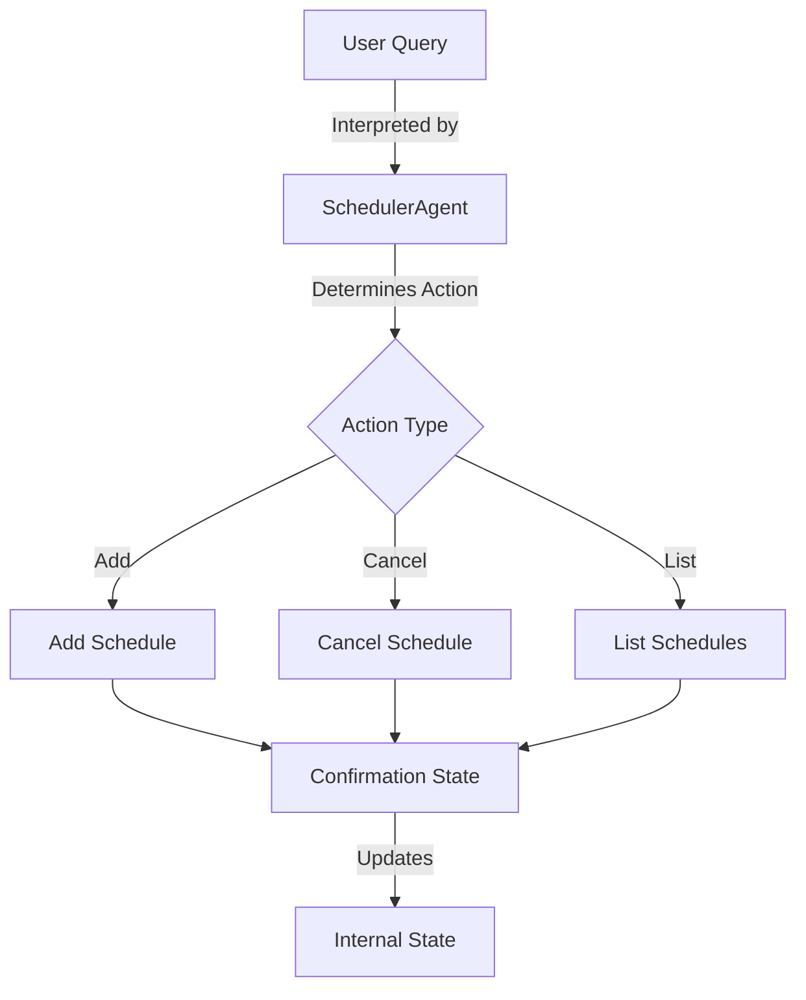
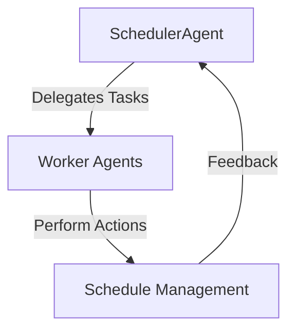

# Agent Scheduler

This project is a sophisticated scheduling agent designed to manage and automate scheduling tasks using AI capabilities. It leverages language models to interpret user queries and perform actions such as adding, listing, and canceling schedules.

## Table of Contents

- [Overview](#overview)
- [Usage](#usage)
- [Architecture](#architecture)

## Overview

The Agent Scheduler is designed to streamline scheduling operations by utilizing AI to interpret user inputs and manage tasks. It supports various scheduling configurations, including scheduled, delayed, and cron-based tasks. The system is built to handle dynamic scheduling requests and confirmations, making it a versatile tool for managing time-based operations.

## Usage

To start using the Agent Scheduler, ensure you are in the root of the project directory. The following npm scripts are available:

- **dev**: Starts the development server.

```
npx nx dev agent-scheduler
```

- **build**: Builds the project for production.

```
npx nx build agent-scheduler
```

- **test**: Runs the test suite.

```
npx nx test agent-scheduler
```

### API Usage

The Agent Scheduler exposes an API for interacting with scheduling tasks. Below are the details for each API call:

#### Add Schedule

- **Request**:
  - Method: POST
  - Endpoint: `/api/schedule/add`
  - Body:
    ```jsonc
    {
      "query": "Schedule a meeting tomorrow at 10 AM"
    }
    ```

- **Response**:
  - Status: 200 OK
  - Body:
    ```jsonc
    {
      "confirmation": {
        "id": "12345",
        "action": "add",
        "schedule": {
          "type": "scheduled",
          "date": "2023-10-10T10:00:00Z",
          "payload": "Meeting"
        }
      }
    }
    ```

- **Curl Command**:

```
curl -X POST http://localhost:3000/api/schedule/add -H "Content-Type: application/json" -d '{"query": "Schedule a meeting tomorrow at 10 AM"}'
```

#### Cancel Schedule

- **Request**:
  - Method: POST
  - Endpoint: `/api/schedule/cancel`
  - Body:
    ```jsonc
    {
      "query": "Cancel the meeting scheduled for tomorrow"
    }
    ```

- **Response**:
  - Status: 200 OK
  - Body:
    ```jsonc
    {
      "message": "No matching task found to cancel."
    }
    ```

- **Curl Command**:

```
curl -X POST http://localhost:3000/api/schedule/cancel -H "Content-Type: application/json" -d '{"query": "Cancel the meeting scheduled for tomorrow"}'
```

## Architecture

The Agent Scheduler is an application that utilizes a multi-agent pattern to manage scheduling tasks. Below is a high-level overview of its architecture:



### Multi-Agent Pattern

The Agent Scheduler employs a multi-agent pattern where specialized agents collaborate to execute complex scheduling tasks. This pattern allows for efficient task management and dynamic response to user queries.



This architecture ensures that the system can handle a variety of scheduling requests efficiently and effectively.

<!-- Last updated: 4bf59f07e49eedf0518ec7e55d6094bdf0a84ac6 -->